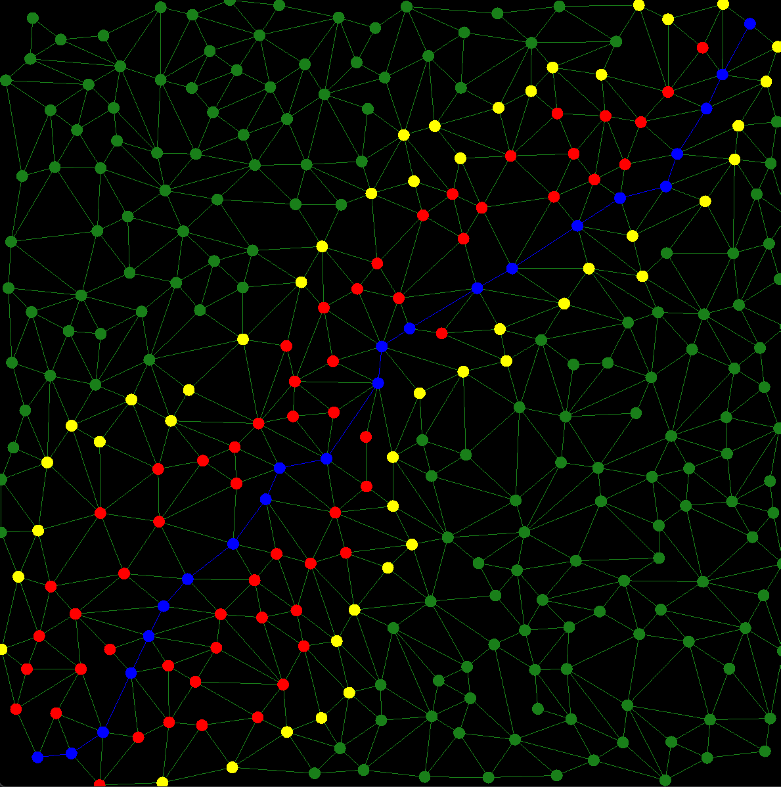

# Rust A Star

## Overview 
This Rust program is a library *astar_lib* and a program *astar_test*. It implements the A Star algorithm.
The graph is supposed to be a navigation graph. Every node represents a position in two dimensional coordinates and 
the edge annotation is the distance between the two nodes, that are connected via an edge. 
Besides that it contains a construction system for suitable graphs and an OpenGL visualization. The project comes
with a full documentation and unit test suit. 

## Contents
The library *astar_lib* contains four modules.

1. **math_helper**: This module contains a vector class *Vec2*, that is used almost everywhere. Additionally, there
is a *Line* class in there that helps with the graph construction.
2. **a_star**: This is the core module that represents the graph representation and the search algorithm (*NavGraph*)
3. **graph_constructor**: This is a helper module that generates random graphs, that obey a couple of rules to be pretty.
4. **graphics**: This module does the visualization with OpenGL and the basic interaction. 

## Program Usage
With the left mouse button you can pick one of the graph nodes. On mouse over over a different node, the system
computes and generates the shortest path if possible and displays path and the states of the nodes in the A Star 
algorithm after completion. Byy clicking the right mouse button a new graph gets generated.

An example can be seen in the following image:

<figure>
    
    <figcaption>Screenshot of the A Star Program</figcaption>
</figure>


## Getting Started with Rust
If you are new to Rust (like I was a couple of days ago), here is a quick start:

1. Install Rust
2. Build Run and Test the various components.

### Install Rust
For *Linux* and *MacOS* users, open a terminal and enter the following command:
```
curl --proto '=https' --tlsv1.3 https://sh.rustup.rs -sSf | sh
```
for *Windows* user get to the website
[Windows Installer](https://www.rust-lang.org/tools/install).

In both cases you will wind up with mainly three programs:
- **rustup**: This is the installer and updater.
- **rustc**: This is the core compiler of the Rust language. You will rarely interface with it directly.
- **cargo**: This program contains the package manager (something like PiPy in Python) and a complete build system.
  This is the central entry to the rust world.

### Build Run and Test the various components
Once Rust is installed, clone the directory from the repository, open a terminal and navigate to the base directory
where also the file *Cargo.toml* is contained. From here you may now run several commands:

- **cargo test**: This builds the program and runs all contained units tests.
- **cargo doc --open**: Generates and opens the documentation in the browser.
- **cargo run -r**: Generates a release build and starts the program.

## License
The program is published under MIT license as explained in the [license file](LICENSE).


